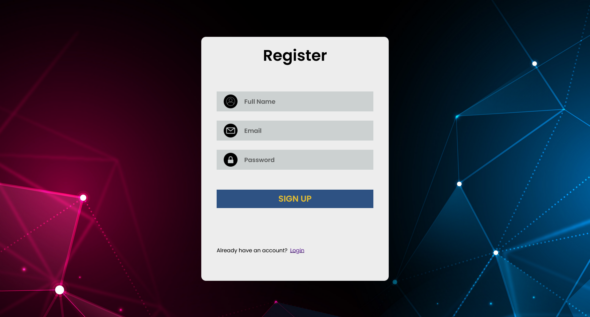

# 🔐 User Authentication Website

A simple and secure user authentication website built with **Node.js**, **Express**, **EJS**, **Passport.js**, and vanilla **HTML/CSS**. It provides user registration, login, session management, and a protected dashboard page.

---

## 🚀 Features

- User registration with email and password
- Secure login with session authentication
- Protected dashboard (accessible only to logged-in users)
- Password hashing using bcrypt
- Flash messages for feedback
- Clean UI using plain HTML and CSS

---

## 🛠️ Tech Stack

- **Backend:** Node.js, Express.js, EJS
- **Authentication:** Passport.js (Local Strategy)
- **Frontend:** HTML5, CSS3
- **Others:** Express-Session, Express-Flash, Bcrypt

---

## 📸 Screens

| Register Page | Login Page | Dashboard |
|---------------|------------|-----------|
|  |  |  |

---

## 📦 Installation

1. **Clone the repository:**

```bash
git clone https://github.com/Aryan-Kumar7369/user-auth-app.git
cd user-auth-app
```

2. **Install dependencies:**

```bash
npm install
```

3. **Create a `.env` file:**

```env
PORT=3000
SESSION_SECRET=secret
```

4. **Run the app:**

```bash
npm start
```

5. Open in your browser:  
`http://localhost:3000`

---

## 📁 Folder Structure

```
user-auth-app/
│
├── src/                  # Static HTML and CSS and images
├── views/                # Template views (EJS)
├── passport.config.js    # Passport config
├── server.js             # Main Express app
├── .env                  # Environment variables
└── package.json
```

---

## 🔑 How It Works

- **Register:** A new user is saved with a hashed password.
- **Login:** Credentials are checked using Passport's local strategy.
- **Session:** Logged-in users are stored in session using `express-session`.
- **Dashboard:** Accessible only after login. Unauthorized access is redirected to login.

---

## 📬 Contact

Made with ❤️ by [Aryan Kumar](https://github.com/Aryan-Kumar7369)
